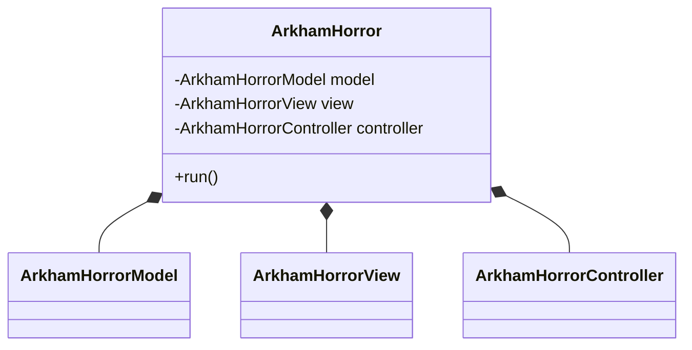
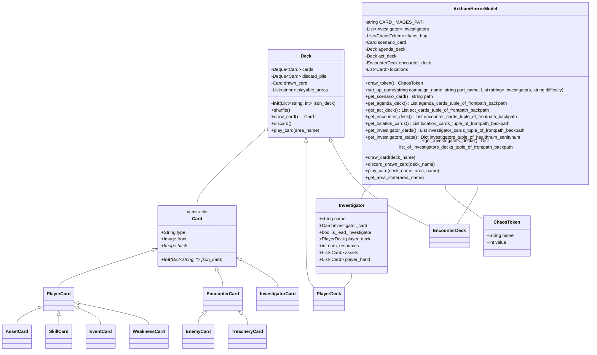
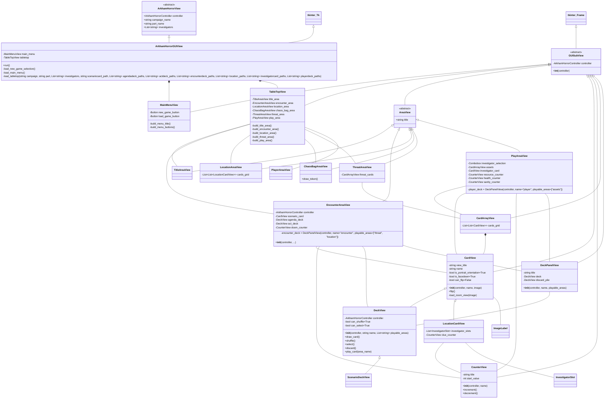
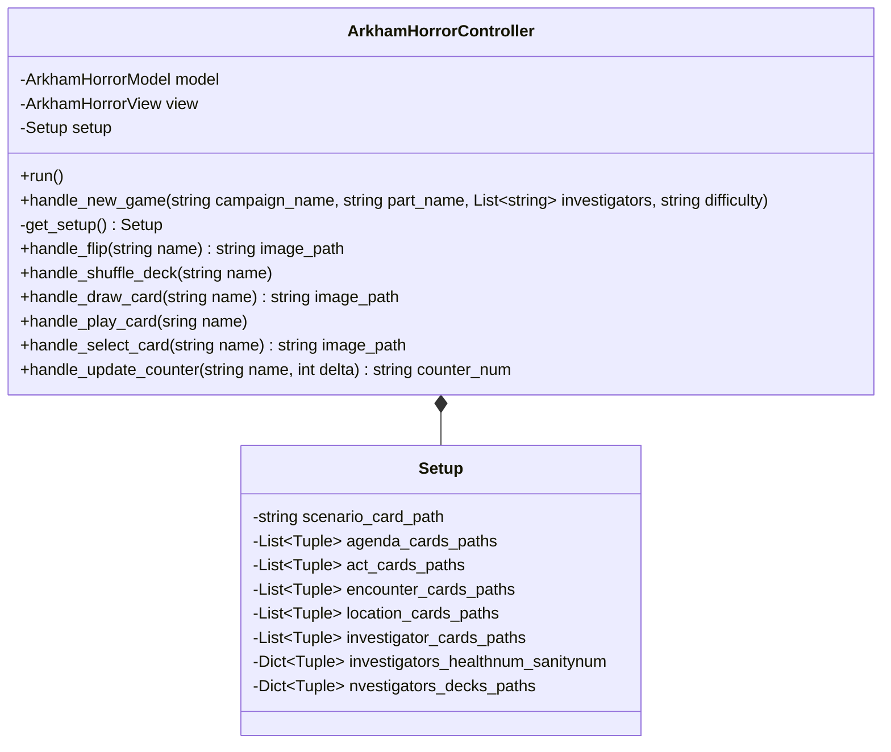
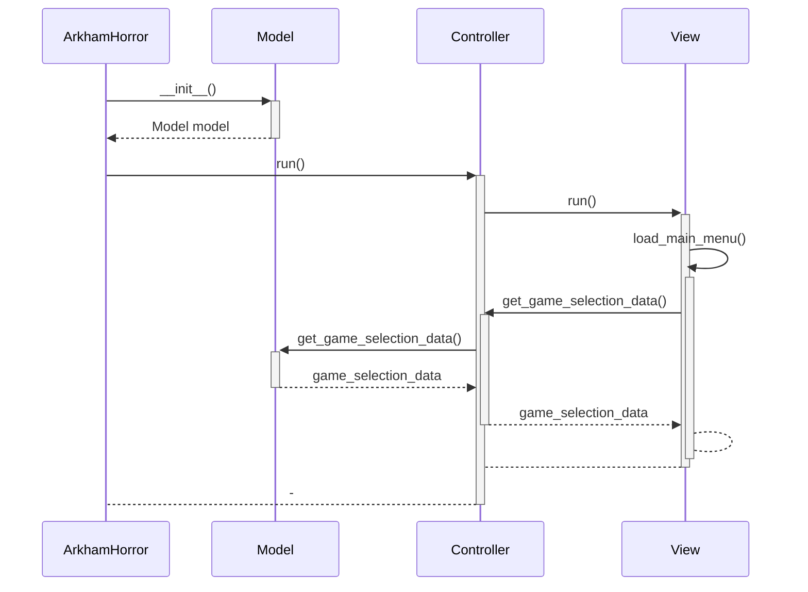
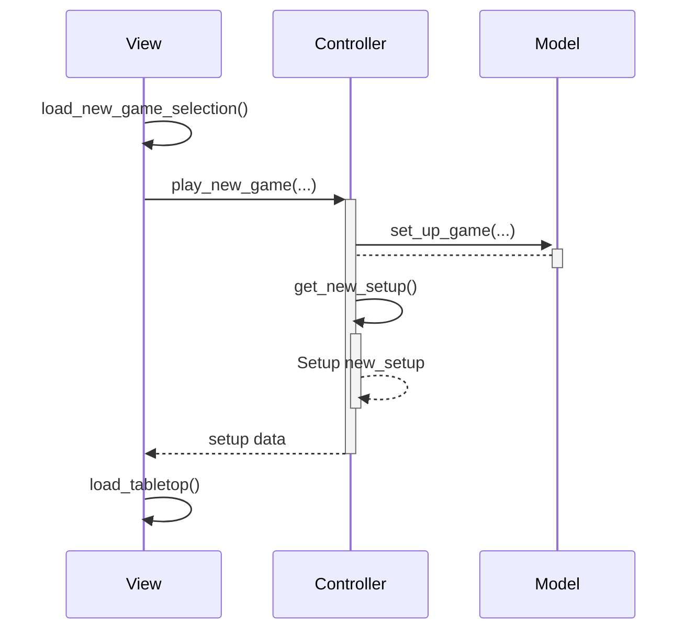
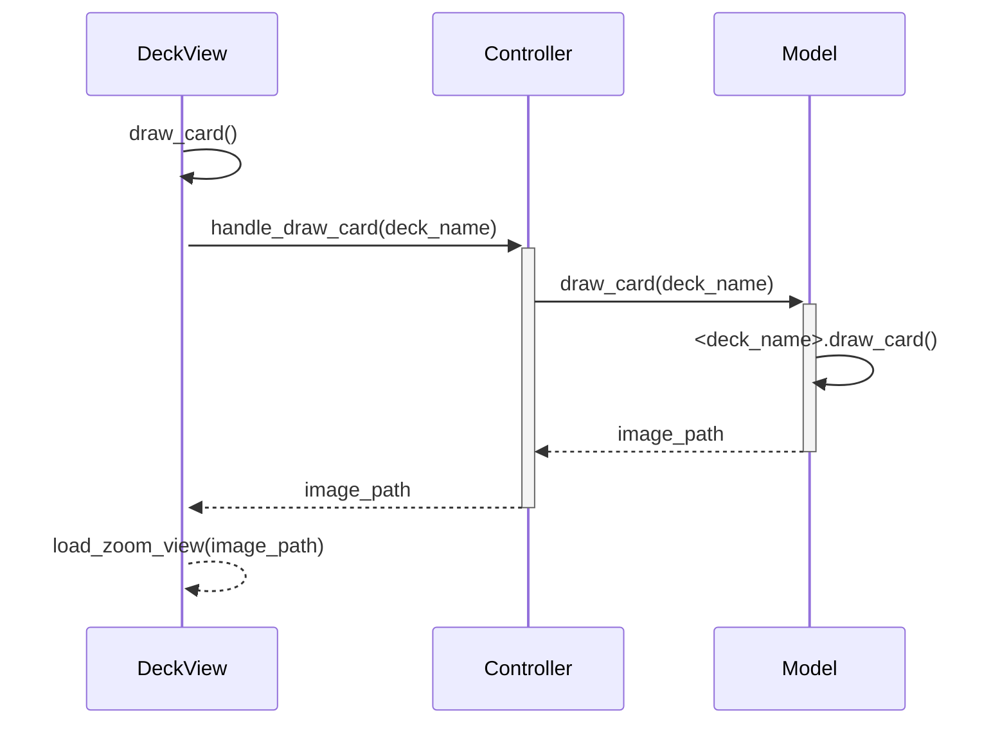
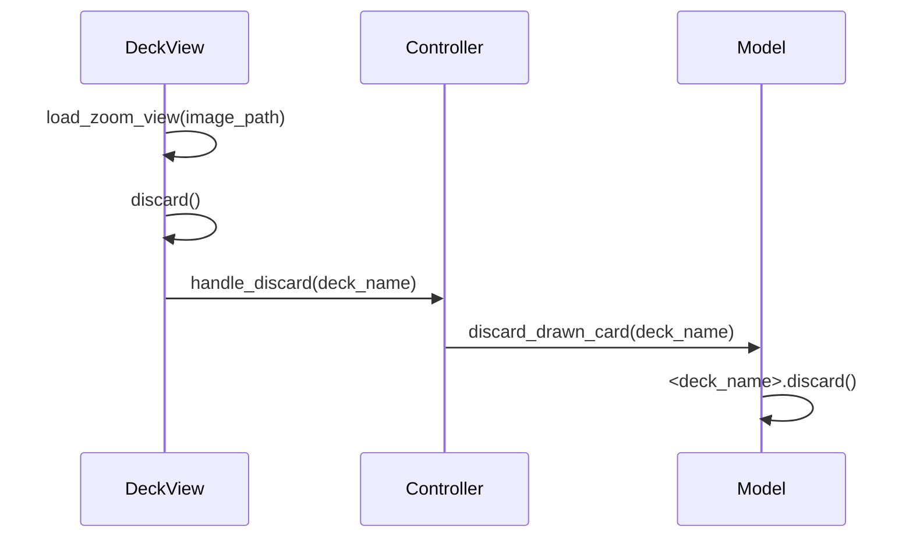
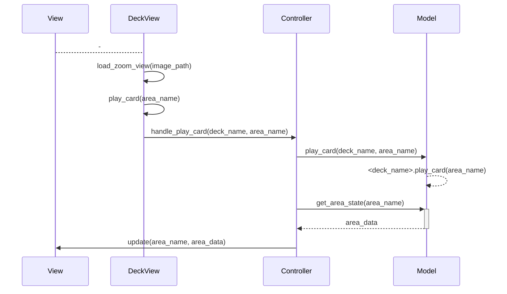

# Design

## Class Diagrams

### MVC

### Model {#ModelClassDiagram}

[Draw Card](#DrawCard)

### View {#ViewClassDiagram}

[Draw Card](#DrawCard)

### Controller {#ControllerClassDiagram}

[Draw Card](#DrawCard)

## Sequence Diagrams

### Run Game

### New Game

### Draw Card from Deck {#DrawCard}

[View](#ViewClassDiagram)
[Controller](#ControllerClassDiagram)
[Model](#ModelClassDiagram)

#### Discard

#### Play

<https://mermaid.live/>
<https://www.fluidui.com/editor/live/>
