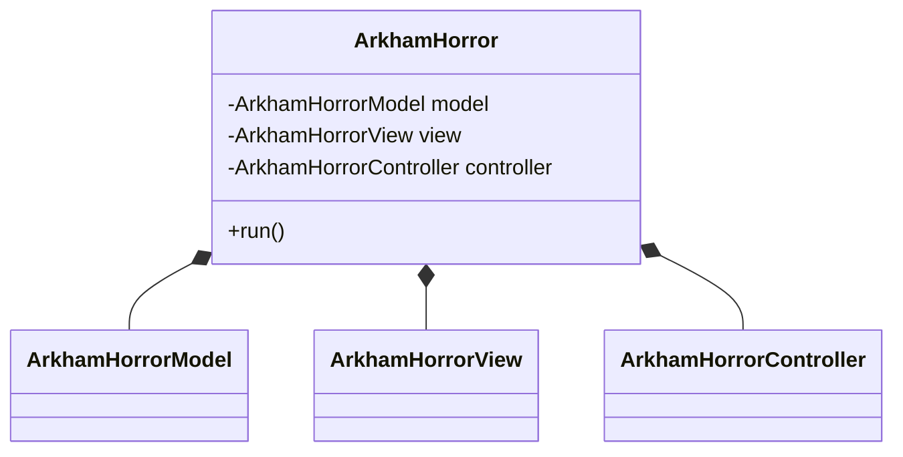
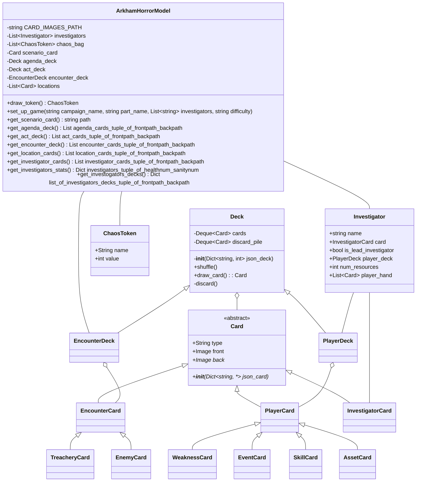
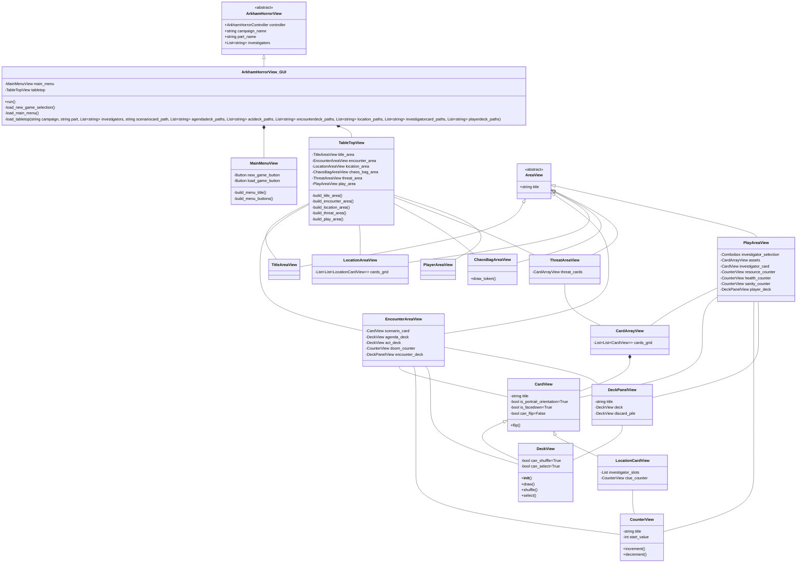
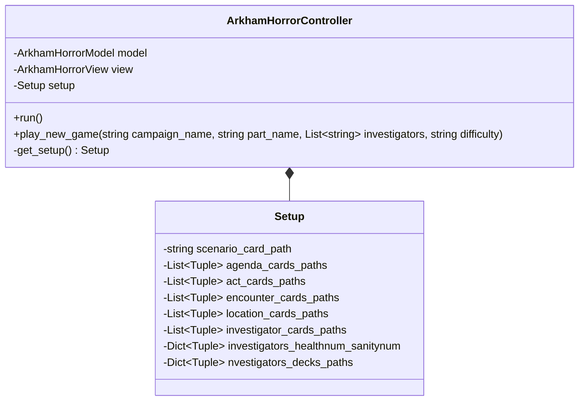
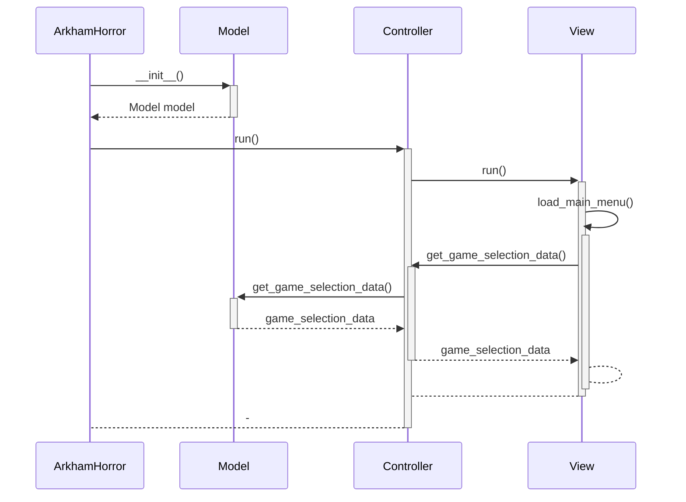
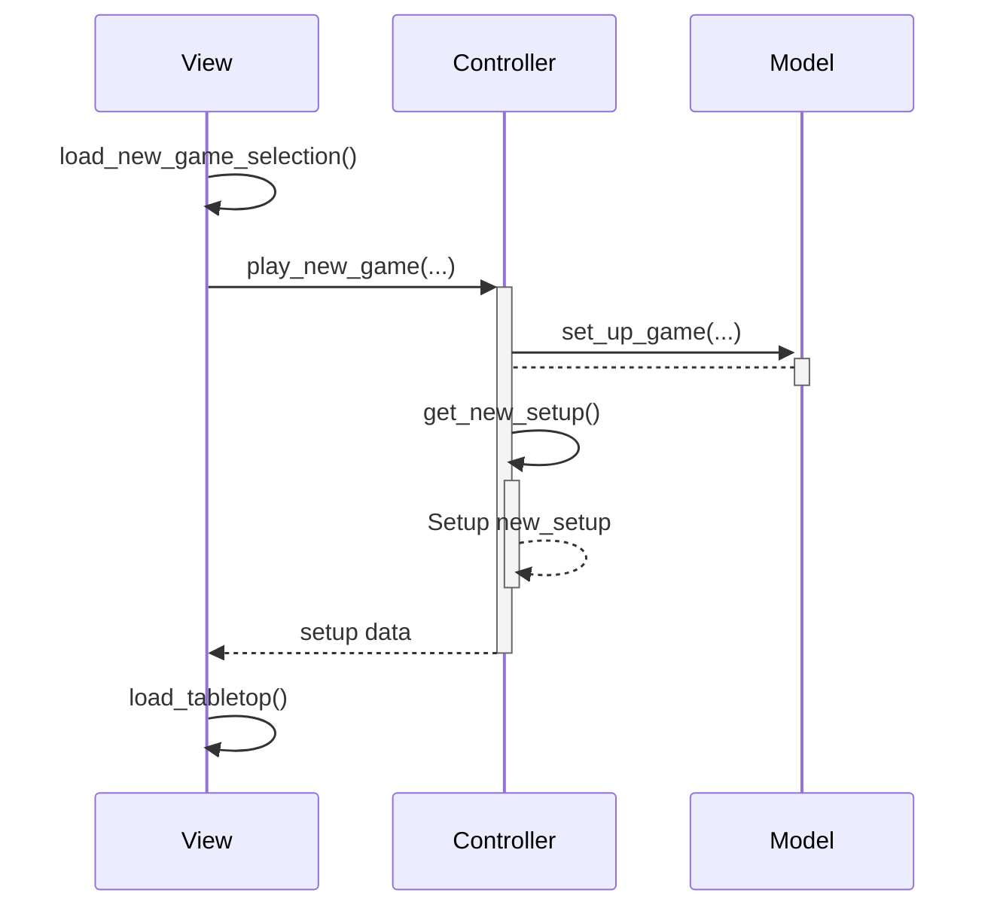

# Design

## High-Level Class Diagram

## Model Class Diagram

## View Class Diagram

## Controller Class Diagram

## Run Sequence Diagram

## New Game Sequence Diagram

<https://mermaid.live/>
